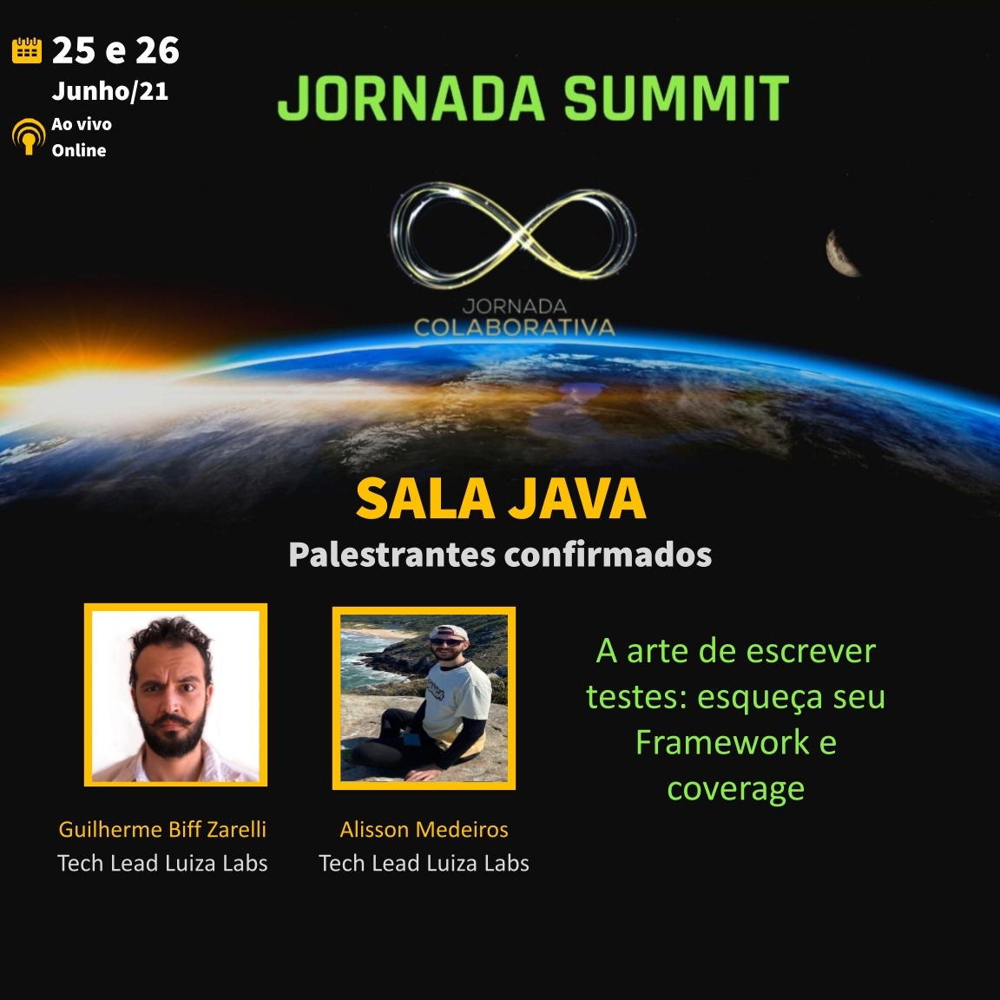

# A arte de escrever testes: esqueça seu Framework e coverage

    

# Código / Branches

- [main](https://github.com/helpdeveloper/jornada-summit-java-unit-tests/tree/main): Estrutura do projeto, sem testes.
- [framework-coverage](https://github.com/helpdeveloper/jornada-summit-java-unit-tests/tree/framework-coverage): Exemplo de testes acoplados com framework e com 100% de coverage que não garante a qualidade do software.
- [art-of-tests](https://github.com/helpdeveloper/jornada-summit-java-unit-tests/tree/art-of-tests) : Testes desacoplados do framework garantindo a qualidade do software.

# Links

- [Apresentação em slides — Jornada Colaborativa Summit 2021](https://docs.google.com/presentation/d/1bZ6BFUdhomU14xmGRO2_3GHXMiRYcpvbcixr1GpR4J4/edit?usp=sharing)
- [Livro — Jornada Java](http://www.brasport.com.br/informatica-e-tecnologia/java/jornada-java/)
- [Pirâmide de Testes — Definindo uma boa suíte de testes para seu Software](https://medium.com/luizalabs/pirâmide-de-testes-definindo-uma-boa-suíte-de-testes-para-seu-software-a6864886f29b)
- [Artigo — Criando uma aplicação modular muito além do Clean Architecture](https://medium.com/luizalabs/criando-uma-aplica%C3%A7%C3%A3o-modular-muito-al%C3%A9m-do-clean-architecture-5dde3687c5d6)

# Desenvolvedores

**Alisson Medeiros**
- LinkedIn - https://www.linkedin.com/in/alisson-medeiros-8bb67830/
- GitHub - https://github.com/AlissonMedeiros
- Email - alisson.medeiros@gmail.com

**Guilherme Biff Zarelli**
- Blog/Site - https://helpdev.com.br
- LinkedIn - https://linkedin.com/in/gbzarelli/
- GitHub - https://github.com/gbzarelli
- Medium - https://medium.com/@guilherme.zarelli
- Email - gbzarelli@helpdev.com.br

## Licence

[Apache-2.0](https://choosealicense.com/licenses/apache-2.0/)
